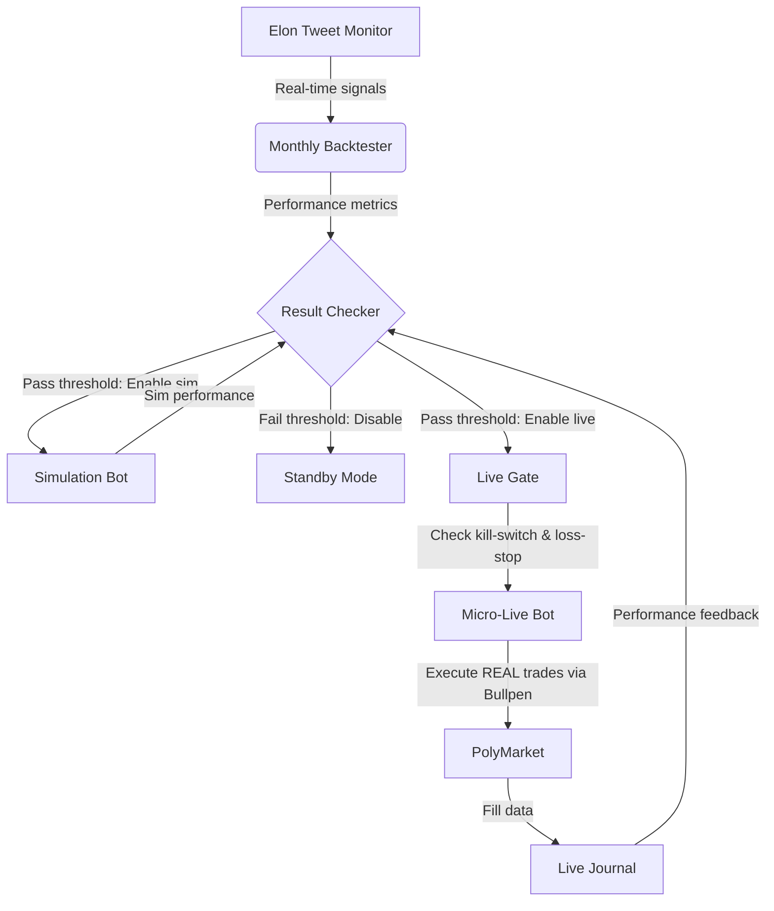

# 🤖 Elon-Tweet Auto-Trader

## 📋 Overview

Autonomous trading system that monitors Elon Musk's tweets for signals, backtests strategies on historical PolyMarket data, simulates live trading, and automatically enables micro-trades ($1-$2 USDC) when statistically significant. Built for educational algorithmic trading with multiple safety layers.

## 🔑 Key Features

- **Signal Source**: Real-time Elon Musk Twitter/X monitoring (via placeholder - integrate with Twitter API)
- **Backtesting**: Monthly automatic backtesting of tweet-based strategies on 1+ years of historical data
- **Simulation Engine**: Live-feel simulation with zero risk (no real orders placed)
- **Statistical Gate**: Only enables live trading when strategy shows statistically significant edge (configurable p-value < 0.05, Sharpe > 1.0)
- **Micro-Live Trading**: Executes REAL trades via Bullpen CLI with strict limits ($1-$2 USDC per trade)
- **Multi-Layer Safety**:
  - Emergency kill-switch (file-based)
  - Daily loss-stop (default $5 USDC)
  - Position sizing limits
  - Your funds never leave your PolyMarket wallet
- **Autonomous Operation**: Designed to run via cron jobs with zero daily maintenance
- **Transparent Journaling**: All trades (simulated & live) logged to CSV for analysis

## ⚙️ How It Works (The Pipeline)



## 🛡️ Safety Mechanisms You Control

1. **Emergency Stop**: Create file `data/strategy-flags/elon-tweet-kill.switch` to halt ALL live trading instantly
2. **Daily Loss-Stop**: Built-in (default: $5 USDC) - stops live trading for remainder of day if loss exceeded
3. **Position Sizing**: Fixed micro-trade size ($1-$2 USDC, adjustable in `run_live.py`)
4. **Credential Isolation**: Uses Bullpen CLI - your PolyMarket API keys stay on YOUR machine
5. **Order Limits**: Max 1 order per 5 minutes during market hours (08:00-20:00 UTC)
6. **No Leverage**: Only long/short prediction market positions (no margin/liquidation risk)

## 📦 Installation & Setup

### Prerequisites
- Linux/macOS/WSL (Ubuntu/Debian recommended)
- Python 3.8+
- [Bullpen CLI](https://bullpen.sh/) (for PolyMarket access)
- Git
- curl/jq (for optional market data refresh)

### Step-by-Step

1. **Clone Repository**
   ```bash
   git clone https://github.com/ag-tech2026/elon-tweet-auto-trader.git
   cd elon-tweet-auto-trader
   ```

2. **Install Bullpen CLI** (ONE-TIME)
   ```bash
   curl -fsSL https://bullpen.sh/install.sh | bash
   bullpen login  # Follow device-code instructions to authenticate with PolyMarket
   ```

3. **Verify Bullpen Works**
   ```bash
   bullpen balance  # Should show your USDC balance
   bullpen markets  # List available prediction markets
   ```

4. **Make Scripts Executable**
   ```bash
   chmod +x skills/*/*/scripts/*.py
   ```

5. **Run Initial Test** (OPTIONAL - see output below)
   ```bash
   ./skills/mlops/elon-tweet-backtest-auto/scripts/run_backtest.py
   ./skills/mlops/elon-tweet-check-results/scripts/check.py
   ./skills/software-development/elon-tweet-market-bot-sim/scripts/run_sim.py
   ./skills/mlops/elon-tweet-gate-live/scripts/gate.py
   ./skills/software-development/elon-tweet-market-bot-live/scripts/run_live.py
   ```

## 🧪 Expected Output from Test Run

Each script is a placeholder that prints:
```
Placeholder: [Backtest|Checker|Simulation|Gate|Live] script
```

Replace these with your actual strategy logic (see "Customization" below).

## 🕒 Enabling Autonomy (Cron Jobs)

The system is designed to run unattended via cron. Example crontab:

```bash
# Edit your crontab
crontab -e

# Add these lines (REPLACE /path/to/with/your/actual/path)
# --- BACKTEST: Runs monthly on 1st at 02:15 AM ---
15 2 1 * * /path/to/elon-tweet-auto-trader/skills/mlops/elon-tweet-backtest-auto/scripts/run_backtest.py >> /path/to/elon-tweet-auto-trader/logs/backtest.log 2>&1

# --- RESULT CHECK: Runs 20 min after backtest ---
35 2 1 * * /path/to/elon-tweet-auto-trader/skills/mlops/elon-tweet-check-results/scripts/check.py >> /path/to/elon-thet/auto-trader/logs/check.log 2>&1

# --- SIMULATION: Runs hourly at minute 5 ---
5 * * * * /path/to/elon-tweet-auto-trader/skills/software-development/elon-tweet-market-bot-sim/scripts/run_sim.py >> /path/to/elon-tweet-auto-trader/logs/sim.log 2>&1

# --- LIVE GATE: Runs every 15 minutes ---
*/15 * * * * /path/to/elon-tweet-auto-trader/skills/mlops/elon-tweet-gate-live/scripts/gate.py >> /path/to/elon-tweet-auto-trader/logs/gate.log 2>&1

# --- MICRO-LIVE: Runs every 5 minutes during market hours (08:00-20:00 UTC) ---
*/5 8-20 * * * /path/to/elon-tweet-auto-trader/skills/software-development/elon-tweet-market-bot-live/scripts/run_live.py >> /path/to/elon-tweet-auto-trader/logs/live.log 2>&1

# --- OPTIONAL: Refresh PolyMarket markets list every 6 hours ---
0 */6 * * * curl -s 'https://api.polymarket.com/0x1/events?limit=500&closed=false' | jq -c '[.[] | {id, question, active_start, active_end, avg_volume_24h, category}]' > /path/to/elon-tweet-auto-trader/data/markets-current.jsonl 2>> /path/to/elon-tweet-auto-trader/logs/markets.log
```

**Important**: Use absolute paths. Verify with `crontab -l` after saving.

## 📁 File Structure

```
elon-tweet-auto-trader/
├── data/
│   ├── historical/                 # Historical tweet/market data (JSONL)
│   │   ├── tweets_2024-01.jsonl
│   │   └── markets_2024-01.jsonl
│   ├── markets-current.jsonl       # Current active PolyMarket fields (JSONL)
│   ├── backtest-results/           # Monthly backtest performance (CSV)
│   ├── simulation-journal/         # Simulated trade logs (CSV)
│   ├── live-journal/               # REAL trade logs (CSV)
│   ├── strategy-flags/             # Control files (kill.switch, enable_sim, etc.)
│   └── logs/                       # Runtime logs from cron jobs
├── skills/
│   ├── mlops/
│   │   ├── elon-tweet-backtest-auto/
│   │   │   ├── SKILL.md
│   │   │   └── scripts/run_backtest.py
│   │   ├── elon-tweet-check-results/
│   │   │   ├── SKILL.md
│   │   │   └── scripts/check.py
│   │   ├── elon-tweet-gate-live/
│   │   │   ├── SKILL.md
│   │   │   └── scripts/gate.py
│   │   └── ... (other MLops skills)
│   └── software-development/
│       ├── elon-tweet-market-bot-sim/
│       │   ├── SKILL.md
│       │   └── scripts/run_sim.py
│       └── elon-tweet-market-bot-live/
│           ├── SKILL.md
│           └── scripts/run_live.py
├── CRON_INSTRUCTIONS.md            # Detailed cron setup guide
└── README.md                       # This file
```

## 🛠️ Customization

### 1. **Modify Signal Logic**
Edit the placeholder scripts in each skill's `scripts/` directory:
- Add Twitter API v2 integration to fetch recent Elon tweets
- Implement your signal extraction (keywords, sentiment, technical patterns)
- Output signals as JSON to be consumed by backtester/simulator

### 2. **Adjust Strategy Parameters**
- **Backtester**: Lookback window, signal delay, position sizing logic
- **Checker**: Performance thresholds (win rate, profit factor, max drawdown)
- **Gate**: Statistical significance levels, cooldown periods
- **Live Bot**: Trade size, max daily trades, expiration preferences

### 3. **Enhance Data Sources**
- Replace sample historical data with your own collected tweets/markets
- Integrate additional signals (Fear & Greed Index, BTC volatility, etc.)
- Add technical indicator calculations (RSI, MACD) to improve signal quality

### 4. **Deploy to Cloud**
For 24/7 operation, deploy to a $5/month VPS:
1. Install Ubuntu 22.04 LTS
2. Follow Steps 1-4 above
3. Set up cron jobs
4. Monitor logs via `tail -f logs/*.log`

## 📊 Monitoring & Reporting

### View Live Trading Activity
```bash
# See most recent live trades
tail -n 20 data/live-journal/elon-tweet-live_$(date +%Y-%m-%d).csv

# Follow live journal in real-time
tail -f data/live-journal/elon-tweet-live_$(date +%Y-%m-%d).csv
```

### Check System Status
```bash
# See active strategy flags
ls -la data/strategy-flags/

# Check if kill switch is active
[ -f data/strategy-flags/elon-tweet-kill.switch ] && echo "LIVE TRADING HALTED" || echo "Live trading enabled"

# View system logs from last run
tail -n 50 logs/live.log
```

### Performance Analysis
```bash
# Monthly backtest results
ls -la data/backtest-results/

# Simulated vs live performance comparison (requires Python/pandas)
# Example: calculate Sharpe ratio, win rate, avg profit per trade
```

## 🔐 Security & Privacy

- **Your Keys Stay Local**: Bullpen CLI stores encrypted credentials in `~/.bullpen/` - never transmitted
- **No External APIs**: Except optional PolyMarket data refresh (read-only) and Twitter API (if implemented)
- **Air-Gapped Option**: Disable cron jobs and run manually for complete network isolation
- **Open Source**: Audit the code - no hidden telemetry or data collection

## ⚠️ Disclaimer & Risk Warning

**This is an educational tool for learning algorithmic trading concepts. NOT financial advice.**

- Start with **micro-trades ($1-$2 USDC)** while validating the system
- Past performance (even simulated) does **not** guarantee future results
- Prediction markets involve risk - you can lose your entire stake
- Only allocate funds you can afford to lose completely
- Comply with local regulations and PolyMarket's terms of service
- The developer assumes no liability for trading losses
- Always do your own research (DYOR) and consider consulting a financial advisor

## 🎯 Getting Started Checklist

- [ ] Install Bullpen CLI and authenticate
- [ ] Verify `bullpen balance` shows funds
- [ ] Make all skills scripts executable
- [ ] Run the test pipeline (5 scripts) to verify file structure
- [ ] Replace placeholder logic with your actual strategy
- [ ] Set up cron jobs (or run manually)
- [ ] Monitor logs and journals for first 48 hours
- [ ] Adjust position sizes/thresholds based on observed performance
- [ ] Enjoy your autonomous tweet-trading experiment! 🚀

---

**Ready to begin?** Replace the placeholder Python scripts with your strategy logic, then let the system run autonomously. Remember: start small, validate constantly, and prioritize capital preservation over profits.

*Built with ❤️ for the open-source trading community.*
